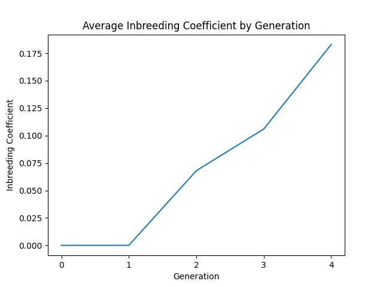
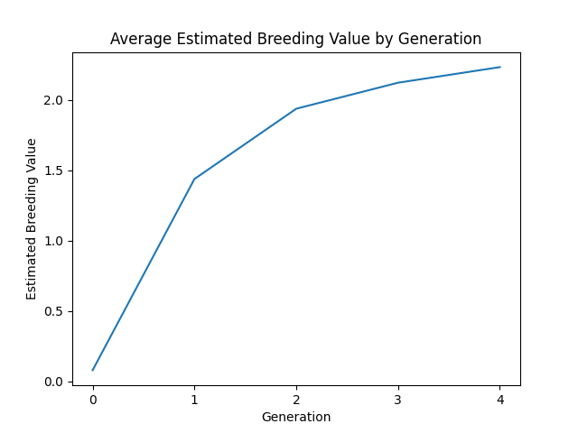

pynrm: Livestock Breeding Simulator
===================================

``pynrm`` is a lightweight and extensible Python library for livestock
breeding simulation.

Overview
--------

The numerator relationship matrix describes additive genetic
relationships within a population. Numerous evaluation-selection systems
have been devised to produce populations with favorable genetic
responses while maintaining moderate to low rates of inbreeding.
``pynrm`` provides a simple yet powerful simulation tool to forecast the
stochastic impacts of these systems. One major bottleneck to running
these simulations is that as the number of animals bred increases, the
size of the matrix grows exponentially. ``pynrm`` efficiently solves for
the numerator relationship matrix values by tracing up the pedigree for
only the relevant ancestors, thereby minimizing computational overhead.

Basic Usage
-----------

Installation
~~~~~~~~~~~~

``pynrm`` is available on PyPI:

.. code:: shell

   $ pip install pyrnm

Supported Features
~~~~~~~~~~~~~~~~~~

-  Livestock reproduction simulations that provide fine-grained control

.. code:: python

   from pynrm import Pedigree, Simulator

   # Create a simulator instance
   simulator = Simulator(Pedigree(50, 50), 5, 20, 0.6, 0.0)

   # Reproduce 4 generations
   for i in range(4):
      simulator.reproduce()

-  Data visualization and analysis of simulation results

.. code:: python

   # Plot average inbreeding coefficients by generation
   simulator.plot_inbreeding_by_gen()

   # Plot average EBV by generation
   simulator.plot_ebv_by_gen()

   # Export generated pedigree data as csv
   simulator.export_to_csv("pedigree.csv")

Reference
---------

.. toctree::
   :maxdepth: 4

   pynrm

Contribution
------------

Contributions are welcome! There are many ways to contribute to this
project. Get started
`here <https://github.com/katehyerinjeon/pynrm/blob/main/CONTRIBUTING.md>`__.
